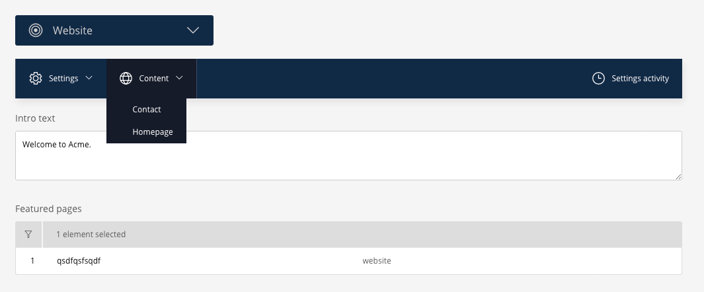

# Sulu Webspace Settings Bundle

Compose per-webspace settings in Sulu 3 the way you compose page templates.

This bundle lets you declare a **settings area** — a PHP attribute plus a template XML — and
editors get a form under *Webspaces* in the admin.



## Requirements

- PHP 8.2+
- Sulu 3.0

## Installation

```bash
composer require eekes/sulu-webspace-settings-bundle
```

Register the bundle in `config/bundles.php`:

```php
Eekes\SuluWebspaceSettingsBundle\SuluWebspaceSettingsBundle::class => ['all' => true],
```

Import the admin API routes in `config/routes/sulu_admin.yaml`:

```yaml
sulu_webspace_settings_api:
    resource: "@SuluWebspaceSettingsBundle/config/routing_admin_api.yaml"
    prefix: /admin/api
```

Add the admin JavaScript to the dependencies in `assets/admin/package.json`:

```json
"sulu-webspace-settings-bundle": "file:../../vendor/eekes/sulu-webspace-settings-bundle/assets/js"
```

Then rebuild the admin:

```bash
bin/adminconsole sulu:admin:update-build
```

That command does the whole JavaScript side itself: it adds the import to `assets/admin/index.js`,
throws away the stale `node_modules`, and runs `npm install` and `npm run build` for you. Running
npm by hand afterwards is not needed.

Create the database tables:

```bash
bin/adminconsole doctrine:migrations:diff
bin/adminconsole doctrine:migrations:migrate
bin/adminconsole cache:clear
bin/websiteconsole cache:clear
```

`doctrine:migrations:diff` writes a migration for *every* difference it finds, not just this
bundle's two tables — read the generated file before running it.

After installing or upgrading, run `bin/adminconsole sulu:reference:refresh` once. Reference rows
are written on save, so existing records have none until they are saved or refreshed — without
them the HTTP cache is not invalidated when a setting changes.

## Declaring an area

An area is one settings screen. The class is both the declaration and the typed read model.

```php
// src/Settings/SocialSettings.php
namespace App\Settings;

use Eekes\SuluWebspaceSettingsBundle\Application\Area\AsSettingsArea;

#[AsSettingsArea(
    key: 'social',
    title: 'app.settings.social',   // translation key; defaults to a humanised key, "Social"
    template: 'social',             // config/templates/settings/social.xml; defaults to the key
    webspaces: ['*'],               // or ['website', 'shop']
    order: 10,
    group: 'app.settings.group.marketing',  // dropdown it is listed under; defaults to "Settings"
    icon: 'su-share',                       // icon of that dropdown; defaults to su-cog
)]
final class SocialSettings
{
    public function __construct(
        public readonly ?string $facebookUrl = null,
        public readonly array $teasers = [],
    ) {
    }
}
```

The fields live in template XML, the same dialect page and snippet templates use, so every content
type — blocks, smart content, media selection, page selection — works unchanged:

```xml
<!-- config/templates/settings/social.xml -->
<template xmlns="http://schemas.sulu.io/template/template">
    <key>social</key>

    <properties>
        <property name="facebook_url" type="text_line">
            <meta><title lang="en">Facebook URL</title></meta>
        </property>

        <property name="teasers" type="smart_content">
            <meta><title lang="en">Teasers</title></meta>
            <params><param name="provider" value="pages"/></params>
        </property>
    </properties>
</template>
```

That is the whole registration. No YAML, no service definition, no Doctrine entity.

Every unique `group` becomes one dropdown in the settings toolbar. Areas that name none share a
single *Settings* dropdown, so a project with a handful of areas never has to think about it. The
group is a translation key, and an untranslated key is shown as it is — a plain label works too.

`icon` is declared per area but drawn on the dropdown, which carries one icon: the first area of a
group wins. Declaring the same icon on every area of a group is the readable way to write that.

An area shipped inside a reusable bundle points at its own template directory from that bundle's
`prependExtension()`:

```php
$builder->prependExtensionConfig('sulu_admin', [
    'templates' => [
        'webspace_settings' => ['directories' => ['my_bundle' => __DIR__ . '/../config/settings']],
    ],
]);
```

### The area class has to be a service

`#[AsSettingsArea]` is found through Symfony's attribute autoconfiguration, which only sees
classes registered as services. In a stock Sulu project everything under `src/` is, so this takes
care of itself — but an area under a path excluded from `services.yaml`, or in a bundle with
`autoconfigure: false`, is silently never registered. If a new area does not show up, check that
first, then clear the admin cache.

## Reading settings

```php
use Eekes\SuluWebspaceSettingsBundle\Application\Reader\SettingsInterface;

public function __construct(private SettingsInterface $settings) {}

$this->settings->get(SocialSettings::class);      // typed read model
$this->settings->resolved('social')->teasers;     // resolved values: media objects, executed queries
$this->settings->raw('social');                   // stored values: ids, smart content configuration
```

Reach for the typed model. `raw()` exists for tooling — migration, validation, diffing — and
`resolved()` for templates that predate a typed model.

Inside a request the webspace and locale come from the request. Outside one — a command, a
messenger handler — name the webspace yourself:

```php
$this->settings->forWebspace('website')->get(SocialSettings::class);
$this->settings->forWebspace('website')->forLocale('de')->raw('social');
```

`forWebspace()` is mandatory outside a request. The bundle never falls back to "the first
configured webspace": that produces a site quietly serving another webspace's settings, which
surfaces in production and nowhere else.

### What the read model receives

`get()` maps resolved values onto the constructor by parameter name, `snake_case` to `camelCase`,
and hands over whatever Sulu's resolver produced for that property: a `single_media_selection`
gives a media object, a `smart_content` gives the executed query's result, a `date` gives a
`Y-m-d` string, a `link` gives the URL it points at. Giving a parameter a default makes the
setting optional; leaving it required and never filling it in raises
`MissingSettingValueException` at read time, which is the point. A value that does not fit the
parameter's type raises `SettingValueTypeMismatchException` and names the model.

The mapping is mechanical, so an acronym splits like any other run of capitals: `facebookUrl`
matches `facebook_url`, but `facebookURL` would look for `facebook_u_r_l`. Name the parameter the
way the template names the property and the question never comes up.

### Twig

```twig
{{ settings('social').facebook_url }}
{{ settings('social', 'other-webspace').facebook_url }}
{{ settings_raw('social').teasers }}
```

`settings()` is a lazy function, not an eager global: an area is resolved on the first property a
template touches, once, and a template that never mentions an area costs nothing.

Four names are taken by methods on the returned object: `get`, `view`, `all` and `count`. A
template property with one of those names still wins — but if no such property exists, the method
answers instead of `null`. Use `settings('social')['count']` where that matters.

### Reading in a long-running process

Reads are memoised for the process. Saving an area empties the memo for it, and `kernel.reset`
empties it entirely — so messenger workers and worker runtimes such as FrankenPHP pick up changes
made elsewhere at the start of each message or request, and a command that writes and then reads
sees its own write.

## What is translated, and what is not

Every field is stored per locale unless it says otherwise. A field opts out with Sulu's own
`multilingual` attribute:

```xml
<property name="vat_number" type="text_line" multilingual="false">
    <meta><title lang="en">VAT number</title></meta>
</property>
```

Sulu's `TemplateDataMapper` writes such a property to the unlocalized dimension content, so it is
stored once and read back in every locale. Mark every field of a template and the whole area is
shared; mark none and it is fully translated; mix them and each field behaves as declared.

The area does not repeat this. Whether the admin shows a locale select — and whether an activity
entry records which language was edited — is read from the template: an area counts as localized
as soon as one of its fields is still multilingual.

Changing the attribute later does not move values that are already stored: they stay in the
dimension they were written to until the area is saved again.

## No draft and publish

Settings are instant-live. There is no workflow, no draft stage, no version history, and a save
takes effect on the website immediately.

That is a scope decision, not an omission. A settings area holds the page-independent data a site
needs in order to render at all — a phone number, a set of social URLs, a checkout notice — and an
editor who saves one expects it to be live. Draft and publish would mean two stages, a publish
button and an unpublished state every template has to cope with, for content that is rarely worth
staging.

The consequence is that the activity trail is the whole answer to *who changed this, and when*.

## Who changed what

Every save that actually changes something is written to Sulu's activity trail, reachable from the
clock icon in the settings toolbar:

> **Jane Doe** has changed the settings "Social"

The acting user comes from the security context, so a save from the console or from a messenger
handler is logged as *Someone*. A save that changes nothing is not logged at all — the admin form
sends a PUT on every save, and a log full of no-op entries is worse than no log.

Entries are scoped to the same security context the endpoints are gated by: per webspace, and per
area when areas carry their own permission. An area a user may not open does not appear in their
trail either.

## Permissions

Every webspace gets a `sulu.webspaces.<webspace>.settings` context, which gates the REST
endpoints.

By default, as soon as a project declares more than one area, each area also gets
`sulu.webspaces.<webspace>.settings_<area>`, so a client can be allowed to edit *Social* but not
*Integrations*.

> **Going from one area to two changes the shape of the permission set.** Roles that only carry
> the webspace context lose access on the deploy that adds the second area, until an administrator
> grants the new per-area permissions. If a project is likely to grow past one area, set
> `permissions.per_area: always` from the start and the set never moves.

## Configuration

The bundle needs no configuration. These are the two things a project cannot work around, so they
are configurable:

```yaml
# config/packages/sulu_webspace_settings.yaml
sulu_webspace_settings:
    templates:
        # where your settings template XML lives
        directory: '%kernel.project_dir%/config/templates/settings'
    permissions:
        # auto:   per-area contexts from the second area onwards (default)
        # always: per-area contexts even with one area, so the permission set never changes shape
        # never:  one permission per webspace governs every area in it
        per_area: auto
```

A bundle that ships its own areas adds a template directory of its own through
`prependExtensionConfig('sulu_admin', ...)`, as shown above, rather than changing this one.

## Maintenance

An area lives in code and a webspace in XML, so neither disappearing is something the bundle can
notice — the records stay behind, invisible in the admin and still in the database:

```bash
bin/adminconsole sulu:webspace-settings:prune           # report
bin/adminconsole sulu:webspace-settings:prune --force   # delete
```

## Versioning

The project follows [semantic versioning](https://semver.org/). Everything marked `@internal` is
outside the backwards compatibility promise; everything else — the `#[AsSettingsArea]` attribute,
`SettingsInterface`, `SettingsManagerInterface`, the domain events, the exceptions and the Twig
functions — is API. See [CHANGELOG.md](CHANGELOG.md).

Every exception the bundle throws implements `SettingsExceptionInterface`, so a project can catch
all of them at once without naming each class.

Entity classes are not replaceable in this version: `WebspaceSettings` and
`WebspaceSettingsDimensionContent` are the concrete models, in the tables `ws_settings` and
`ws_settings_dimension_contents`. If that blocks you, open an issue describing what you need to
change — it is a decision worth making against a real case rather than in the abstract.

## Contributing

See [CONTRIBUTING.md](CONTRIBUTING.md). Issues and pull requests are welcome; everything ships
with tests.

## License

MIT. See [LICENSE](LICENSE).
